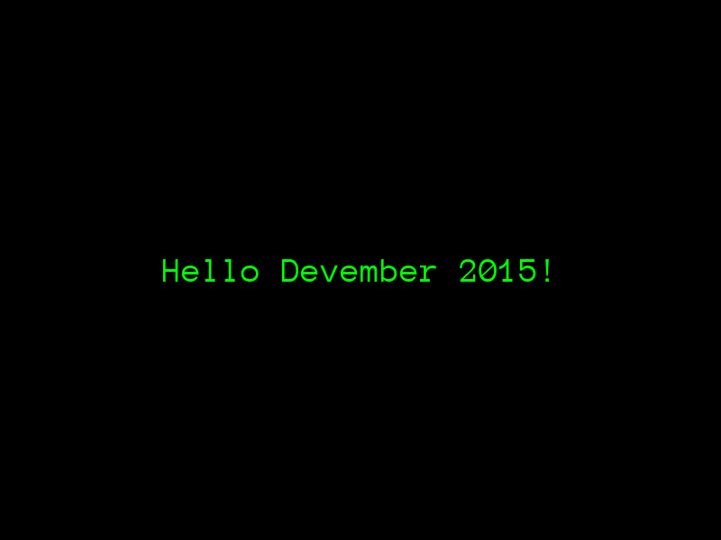

In the past entry a basic scaffolded app was created, and it invoked the NinjaSnowWar game scripts by default. Now the default app will be deleted and a basic one in C++ will be created in its place.

The file `CMakeLists.txt` inside the `$DEVEMBER2015_HOME` should be modified in order to allow us to use C++11 features. After the macro call `setup_main_executable ()` this lines should be added:

```

# Enable C++11
set(CMAKE_CXX_FLAGS "${CMAKE_CXX_FLAGS} -std=c++11")
```

Next the default C++ fles who invoke the interpreter should be deleted:

```bash
cd $DEVEMBER2015_HOME
rm -rf Urho3DPlayer.cpp Urho3DPlayer.h
```

A bare minimum set of C++ files are created, in the `$DEVEMBER2015_HOME` directory, mainly according with [this reference](http://www.gamefromscratch.com/post/2014/10/16/A-closer-look-at-the-Urdo3D-Game-Engine.aspx)


**Main.h**

```cpp
#pragma once

#include <Urho3D/Engine/Application.h>

using namespace Urho3D;

class Main : public Application {
   URHO3D_OBJECT(Main, Application);

public:
   Main(Context*);

   virtual void Setup();
   virtual void Start();
   virtual void Stop() {}

private:
   void HandleKeyDown(StringHash,  VariantMap&);
};
```

**Main.cpp**

```cpp
#include "Main.h"

#include <Urho3D/Engine/Engine.h>
#include <Urho3D/Graphics/Graphics.h>
#include <Urho3D/Input/Input.h>
#include <Urho3D/Input/InputEvents.h>
#include <Urho3D/Resource/ResourceCache.h>
#include <Urho3D/UI/UI.h>
#include <Urho3D/UI/Font.h>
#include <Urho3D/UI/Text.h>

URHO3D_DEFINE_APPLICATION_MAIN(Main)

Main::Main(Context* context)
    :Application(context)
{
}

void Main::Setup(){
   engineParameters_["FullScreen"] = false;
   engineParameters_["WindowWidth"] = 800;
   engineParameters_["WindowHeight"] = 600;
}

void Main::Start(){
   SubscribeToEvent(E_KEYDOWN, URHO3D_HANDLER(Main, HandleKeyDown));

   SharedPtr<Text> text(new Text(context_));
   text->SetText("Hello Devember 2015!");
   text->SetColor(Color::WHITE);
   text->SetFont(GetSubsystem<ResourceCache>()->GetResource<Font>("Fonts/Anonymous Pro.ttf"), 30);
   text->SetColor(Color(0.0f, 1.0f, 0.0f));
   text->SetHorizontalAlignment(HA_CENTER);
   text->SetVerticalAlignment(VA_CENTER);

   GetSubsystem<UI>()->GetRoot()->AddChild(text);
}

void Main::HandleKeyDown(StringHash event, VariantMap& eventData) {
    using namespace KeyDown;

    int key = eventData[P_KEY].GetInt();

    if (key == KEY_ESC) {
        engine_->Exit();
    }
}
```

After that step recreating of the build scripts is needed:

```bash
cd $DEVEMBER2015_HOME
./cmake_generic.sh build
cd build
make
cd ../bin
../build/bin/Main
```

A window should open with a greeting message in green big text. To get rid of it, press **Esc**.



As always the latest source code is in [the Git repository](https://github.com/mizahnyx/devember2015-urho3d).

Also lines were added to the `.gitignore` file in order to ignore the backup files created by Emacs 24. The application log will also be ignored.

```
*~
bin/Urho3D.log
```

Next, 3D objects will be displayed in our application window.
