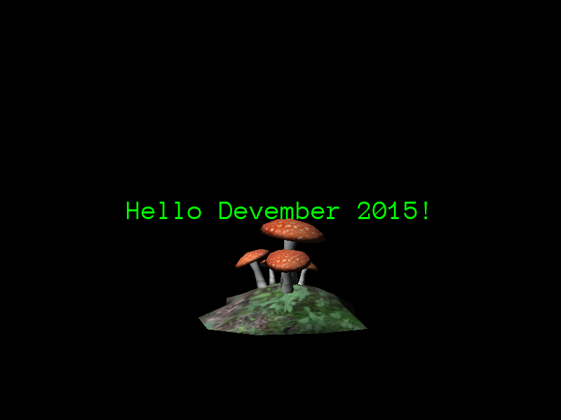

Today a model will be displayed on screen. But first, the projects files that are symlinks should be replaced with hard copies of the files and directories they represent:

```bash
find . -type l -exec bash -c 'l=$(readlink {}) && rm {} && cp -r "$l" {}' \;
```

After that the symbolic links should have been replaced with hard copies of the files they were linked to. Next, the source files must be modified to provide a camera and to load and display a 3D model.

This code will be based on the `StaticScene` example included with Urho3D sources.

Private `CreateScene` and `SetupViewport` methods will be declared in the `Main.h` file:

```cpp
private:
   void CreateScene();
   void SetupViewport();
```

Headers are added at the top for the classes we will use later:

```cpp
#include <Urho3D/Scene/Node.h>
#include <Urho3D/Scene/Scene.h>
```

Protected `SharedPtr`s to a `Scene` and a `CameraNode` will be included also there:

```cpp
protected:
   SharedPtr<Scene> scene_;
   SharedPtr<Node> cameraNode_;
```

Headers will be added to the top of the `Main.h` file:

```cpp
#include <Urho3D/Graphics/Camera.h>
#include <Urho3D/Graphics/Model.h>
#include <Urho3D/Graphics/Octree.h>
#include <Urho3D/Graphics/Renderer.h>
#include <Urho3D/Graphics/StaticModel.h>
```

The `Main::CreateScene` implementation will be created in the `Main.cpp` file:

```cpp
void Main::CreateScene()
{
    ResourceCache* cache = GetSubsystem<ResourceCache>();

    scene_ = new Scene(context_);
    scene_->CreateComponent<Octree>();

    Node* lightNode = scene_->CreateChild("DirectionalLight");
    lightNode->SetDirection(Vector3(0.6f, -1.0f, 0.8f));
    Light* light = lightNode->CreateComponent<Light>();
    light->SetLightType(LIGHT_DIRECTIONAL);

    Node* node = scene_->CreateChild("Mushroom");
    node->SetPosition(Vector3(0.0f, 0.0f, 0.0f));
    node->SetRotation(Quaternion(0.0f, 0.0f, 0.0f));
    StaticModel* object = node->CreateComponent<StaticModel>();
    object->SetModel(cache->GetResource<Model>("Models/Mushroom.mdl"));
    object->SetMaterial(cache->GetResource<Material>("Materials/Mushroom.xml"));

    cameraNode_ = scene_->CreateChild("Camera");
    cameraNode_->CreateComponent<Camera>();
    cameraNode_->SetPosition(Vector3(0.0f, 1.0f, -5.0f));
}
```

The `Main::SetupViewport` implementation will also be created in the `Main.cpp` file:

```cpp
void Main::SetupViewport()
{
    Renderer* renderer = GetSubsystem<Renderer>();

    SharedPtr<Viewport> viewport(new Viewport(context_, scene_, cameraNode_->GetComponent<Camera>()));
    renderer->SetViewport(0, viewport);
}
```

The `Main::Start` method will be changed adding invocations to the methods previously defined before the call to `SubscribeToEvent`:

```cpp
void Main::Start(){
   CreateScene();

   SetupViewport();
   
   SubscribeToEvent(E_KEYDOWN, URHO3D_HANDLER(Main, HandleKeyDown));
```

The resulting window will display a mushroom behind the UI text:



The next step will be to be able to import our own assets into the engine.
