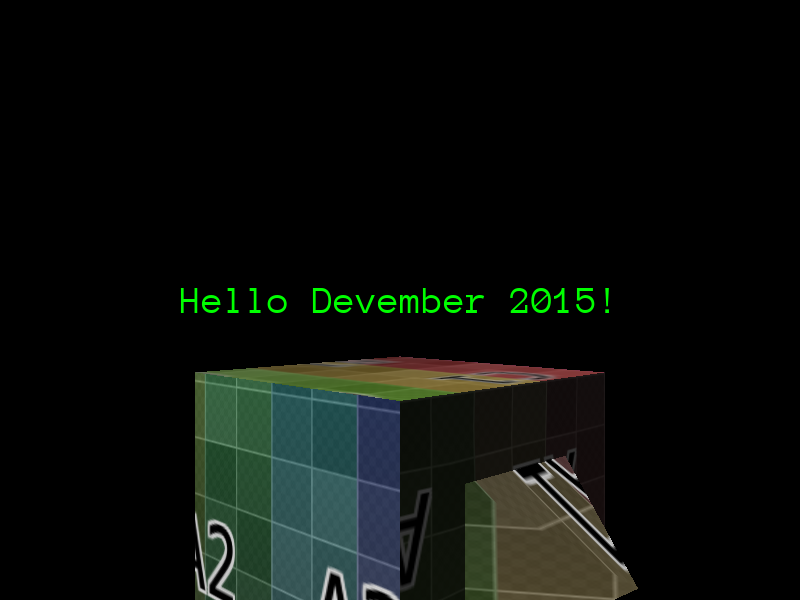

Today a 3D model will be imported into Urho3D.

Inside the `$DEVEMBER2015_HOME/bin/Data` there are datafiles used by Urho3D's samples and tools. This datafiles aren't needed and will be deleted:

```bash
cd $DEVEMBER2015_HOME
rm -rf bin/Data/*
```

Also the `AssetImporter` executable should be in the path. This command is located in the `$URHO3D_HOME/bin/tool`:

```bash
export PATH=$PATH:$URHO3D_HOME/bin/tool
mkdir -p bin/Data/Models
```

A model is created in Blender3D, a free modeling software, and exported as a COLLADA file with textures. Let the model be `$DEVEMBER2015_HOME/Models/example_model.blend` and its exported file as `$DEVEMBER2015_HOME/Models/example_model.dae`:

```bash
cd bin/Data
AssetImporter model $DEVEMBER2015_HOME/Models/example_model.dae Models/ExampleModel.mdl
```

The part of the code that loads the model should be changed with new values:

```cpp
    Node* node = scene_->CreateChild("ExampleModel");
    node->SetPosition(Vector3(0.0f, 0.0f, 0.0f));
    node->SetRotation(Quaternion(0.0f, 135.0f, 0.0f));
    StaticModel* object = node->CreateComponent<StaticModel>();
    object->SetModel(cache->GetResource<Model>("Models/ExampleModel.mdl"));
    object->SetMaterial(cache->GetResource<Material>("Materials/Material.xml"));
```

And the font "Anonymous Pro" that was deleted with the contents of the `Data` directory should be copied from `$URHO3D_HOME`:

```bash
cd $DEVEMBER2015_HOME
cd bin/Data
mkdir Fonts
cp $URHO3D_HOME/bin/Data/Fonts/Anonymous\ Pro.ttf Fonts/
```

The final image will show the imported object.



Next, navigation controls will be added to the imported object.
